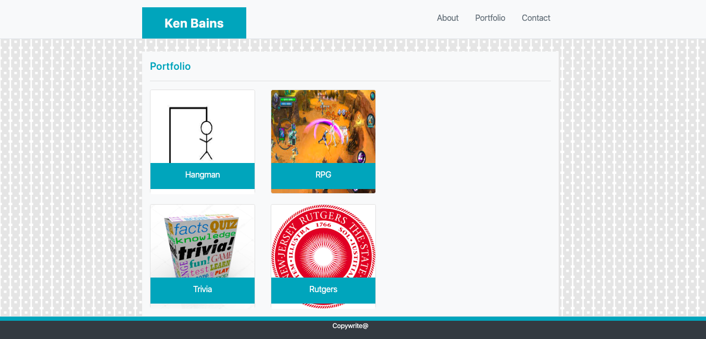

# bootstrap-portfolio

## Summary 
This site showcases my work with bootstrap. It has information about me, my contact information, and a page with links to my projects. 

## Link to site
https://ken-bains.github.io/bootstrap-portfolio/

## Site Picture



## Technologies Used
- HTML - used to create elements on the DOM
- CSS - styles html elements on page
- Git - version control system to track changes to source code
- GitHub - hosts repository that can be deployed to GitHub Pages
- Bootstrap - front-end framework used to create modern websites and web apps.

## Code Snippet
```html
<body>
 <header class="navbar-light bg-light mb-4 border-bottom">
        <div class="container">
            <div class="row">
                <div class="col-md-1" ></div>
                <div class="col-md-10">
                    <div class="row">
                        <div class="col-sm-12 col-md-6 pl-0 pr-0">
                            <p class="text-center text-light py-3 bg-info font-weight-bold h4 mb-0">Ken Bains</p>
                        </div>
                        <div class="col-sm-12 col-md-6 pl-0 pr-0">
                            <ul class="nav justify-content-end">
                                <li class="nav-item">
                                    <a class="nav-link active text-secondary" href="index.html">About</a>
                                </li>
                                <li class="nav-item">
                                    <a class="nav-link text-secondary" href="portfolio.html">Portfolio</a>
                                </li>
                                <li class="nav-item">
                                    <a class="nav-link text-secondary" href="contact.html">Contact</a>
                                </li>
                            </ul>
                        </div>
                    </div>
                </div>
                <div class="col-md-1"></div>
            </div>
        </div>
    </header>
```
- The code snipit above is an example of code that was used to create the navbar. 


## Author Links
[LinkedIn](www.linkedin.com/in/ken-bains)
[GitHub](https://github.com/ken-Bains)
